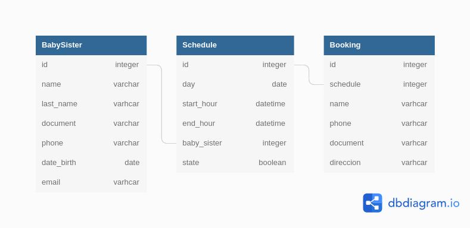
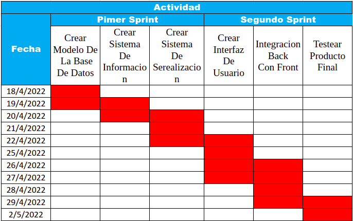

# Proyecto Baby Care

### Descripcion del problema

BabyCare es un emprendimiento que busca brindar una alternativa de ingresos a jóvenes estudiantes mediante la prestación de servicios de niñera a domicilio por horas.
Actualmente las solicitudes de servicio se realizan por teléfono, debido a la alta demanda con frecuencia los clientes realizan solicitudes en fechas / horas similares lo que causa que no se cuente con disponibilidad de personal, esto debido a que existen días de la semana en los que se presenta más demanda que otros (los viernes por ejemplo), adicionalmente es posible que algunas de las niñeras no cuenten con disponibilidad debido a actividades académicas o personales.
Esto genera malestar en los clientes y pérdidas para la empresa, lo que hace deseable contar con algún mecanismo que permita conocer la disponibilidad del personal y permitir a los clientes solicitar el servicio a partir de dicha disponibilidad. Para el cliente debe ser totalmente transparente quien le prestará el servicio, solo requiere tener la certeza de que el turno estará cubierto. 

### Modelo bases de datos



### Sprint




### Estructura


# Variables de entorno
* Archivo de varibles de entorno .env
```
#Django DB
POSTGRES_DB=baby_care
POSTGRES_USER=baby_care_user
POSTGRES_PASSWORD=baby_care.
POSTGRES_HOST=postgres
POSTGRES_PORT=5432

#Config django
SECRET_KEY= django-insecure-_33yemiuffdbatcf@w#d!8e7^cj6cn=x^q(*w+mna1reubk_i=
DEBUG=True
DJANGO_SETTINGS_MODULE=backend.settings.dev

#Email
EMAIL_HOST=smtp.gmail.com
EMAIL_USE_TLS=True
EMAIL_PORT=587
EMAIL_HOST_USER=pruebas.jcsq@gmail.com
EMAIL_HOST_PASSWORD=CamiloSuarez04
DEFAULT_FROM_EMAIL=pruebas.jcsq@gmail.com

#Db_test
DB_NAME_TEST=baby_care
DB_USER_TEST=baby_care_user
DB_PASS_TEST=baby_care.
DB_SERVICE_TEST=postgres
DB_PORT_TEST=5432

```
# Makefile
En el se encuentran comandos configurados para la facilidad, 
ejecucion y desarrollo del proyecto; los comandos 
disponibles son:


* Ejecutar migraciones
``` bash
make migrate
```
* correr el servidor
``` bash
make up
```
* Crear superusuario
``` bash
make superuser
```
* Crear app
``` bash
make app name=my_app
```
* correr los test
``` bash
make test
```
* Entrar a la terminal de python
``` bash
make shell
```
* Instalar requerimientos
``` bash
make requirements
```
* Exportar los datos a json
``` bash
make export_data
```
* Cargar datos al sistema del archivo disponible
``` bash
make import_data
```
* Vaciar Base de datos
``` bash
make clean_data
```

* Cargar los estaticos
``` bash
make statics
```
### Pre-requisitos
1. install python
2. install pip

### inicio 


1. Iniciar todo el cargue del sistema
   * `make build` solo se usa una vez este carga todas
   las dependencias del sistema, requerimientos, datos, apps
     etc.
  
### Readme development
* Desarrollando la app en local

  1.`make migrate` prepara y carga las migraciones.
       
  2.`make up` corre el servidor local para desarrollo.
    
